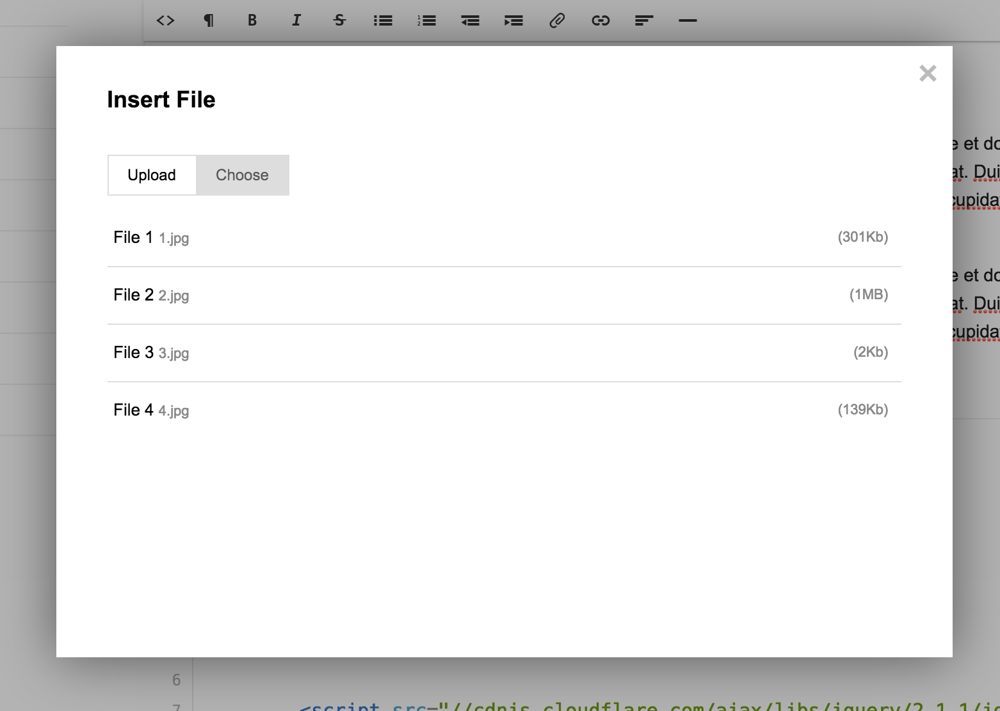

I needed the ability to upload files within a text editor for a project at work and the obvious choice was [Redactor](http://imperavi.com/redactor/). If you have never used it, do. It's awesome. BUT, like many other packages and third party services the documentation isn't that clear. I fumbled around for way longer than I should have had to and that's the only reason I am writing this.  

### Unclear Documentation 

On the [demo page](http://imperavi.com/redactor/plugins/file-manager/) they give the following example:

<pre><code class="language-javascript">
$(function()
{
    $('#redactor').redactor({
        focus: true,
        fileUpload: '/upload.php',
        fileManagerJson: '/files/files.json',
        plugins: ['filemanager']
    });
});
</code></pre>

And then a second example of what files.json should contain
 
```javascript
[
    { "title": "Some Image", "name": "1.jpg", "link": "/images/1.jpg", "size": "301Kb"  },
    { "title": "My Book", "name": "my-book.pdf", "link": "/files/my-book.pdf", "size": "1MB"  }
]
```

The first few questions that come to mind: 
* What is fileManagerJson exactly referring to? 
* What reads the output of that file? 
* Are all of those parameters required? 
* Are the keys supposed to match exactly? 
* wtf?

In the [documentation page](http://imperavi.com/redactor/docs/upload-files/) they give an example of /upload.php

```php
move_uploaded_file($_FILES['file']['tmp_name'], '/files/'.$_FILES['file']['name']);
 
$array = array(
    'filelink' => '/files/'.$_FILES['file']['name'],
    'filename' => $_FILES['file']['name']
);
 
echo stripslashes(json_encode($array));
```

Then another example of json that this file should return.

```javascript
{ "filelink": "/files/file.doc", "filename": "Filename" }
```

[Okay so now more questions:](http://cdn3.gurl.com/wp-content/uploads/2015/01/anewgirlgif.gif) 
* Again, what uses this output? 
* Why are the keys different from the other example? (filename vs name)

Stuff like this can turn what should of been a simple 30 minutes into a couple hours.

## Let Me Break It Down Step By Step
I will map out exactly what you need to know to get a working implementation of the file manager in Redactor.

##### 1. Install Redactor
I assume you already have but [these instructions](http://imperavi.com/redactor/docs/how-to-install/) are simple and straight-forward.

##### 2. Install File Manager
[Download](http://imperavi.com/webdownload/redactor/plugin/?plugin=filemanager) the file manager. Put it in your public /js folder (or whatever works according to your folder structure). Include it after redactor at the bottom of your page.

```markup
<script src="/js/redactor/plugins/filemanager.js"></script>
```

#### 3. Configure File Manager
I'll explain a couple of these parameters.

```javascript
$(function()
{
    var baseUrl = 'http://' + window.location.host;
    
    $('#redactor').redactor({
        focus: true,
		fileUpload: baseUrl + '/actions/review/file/saveFile',
		fileManagerJson: baseUrl + '/uploads/review/files.json',
		uploadFileFields: {
			'title': '#redactor-filename'
		},
        plugins: ['filemanager']
    });
});
```

**fileUpload** is the path of the script that will get your file, upload it to a directory and then output some attributes about that file. It needs the output of this file so it can include a link in the text editor once a user has completed a file upload. Redactor is picky about the output. If nothing is returned, after the file is uploaded it will seem as if nothing happened whether or not the file uploaded successfully or not. The output returned must be formatted in json and include a "filelink" and a "filename". You cannot name these attributes whatever you want. Again, this is the example they give:

```javascript
{ "filelink": "/files/file.doc", "filename": "Filename" }
```

**fileManagerJson** is a json file that is similar to the output returned in your upload script. Similar enough to confuse you. Example below: 
 
 ```javascript
 [
     { "title": "Some Image", "name": "1.jpg", "link": "/images/1.jpg", "size": "301Kb"  },
     { "title": "My Book", "name": "my-book.pdf", "link": "/files/my-book.pdf", "size": "1MB"  }
 ]
 ```
 
This must be an array that contains a "title", "name", "link" and "size". Whatever is in this array will be displayed in the File Manager option in the redactor File Manager modal. (example screenshot below) It will read from this file every time and allow you to link any of the items in that list. Make sure these files exist since redactor doesn't know or check that at all. It just needs the data from this file so do the appropriate testing. I am not covering that here.  
 
{.image-medium}

**uploadFileFields** is a $_POST property that will get sent along with the uploaded file. Redactor allows you to send $_POST data along with your files. The other three will all be extracted from the $_FILES array. The value of this parameter is contained in an id: #redactor-filename. The is the title value you entered into an input in the redactor dialogue when uploading the file. You need this parameter to send this title to your script so you can save it to your fileManagerJson file. This is not clear in the documentation at all and it's all over the place. Not only that, but if you upload an image using the filemanager it will upload but this parameter won't send anything. It only sends the $_POST variable for documents. You will have to add the "uploadImageFields" as well: 

```javascript
		uploadFileFields: {
			'title': '#redactor-filename'
		},
		uploadImageFields: {
			'title': '#redactor-filename'
		},		
```

This parameter is used with their image manager plugin. They assume that you are using the file manager for uploading anything other than images, even though an image IS a file. It's a fair assumption but it should be clarified or defined SOMEWHERE. 
 
#### 4. Build Your Upload Service

Below is the service class I wrote for this. Send your data to a route or controller that eventually uses a service like the example below. I put most of this in one method for the sake of readability.

_(Also note I am using a package called [Flysystem](http://flysystem.thephpleague.com/) by injecting it into my constructor. Learn how to [install it here](http://flysystem.thephpleague.com/installation/))_

```php
<?php namespace App\Services;

use League\Flysystem\Filesystem as Files;

class RedactorFilesService
{
    /**
     * @var \League\Flysystem\Filesystem
     */
    private $files;

    // This stores what redactor users will view in the existing files list
    protected $fileManagerJsonContents = [];

    /**
     * @param \League\Flysystem\Filesystem $files
     */
    function __construct(Files $files)
    {
        $this->files = $files;
    }

    /**
     * save
     *
     * @param $files
     * @param $input
     * @param $path
     * @param $url
     */
    public function save($files, $input, $path, $url)
    {
        // Hydrate $this->output with the existing file list from the json file
        $this->getExistingFileList();

        // This is what this class will return.
        // The format requirements are different which is really stupid
        // Instead of 'link' and 'name' you must return 'filename' & 'filelink'
        $returnOutput = [];

        // Take the $files array and append $this->$fileManagerJsonContents.
        // We need to append it so the files in the directory will always be available
        // and it won't overwrite everytime a new file is uploaded
        foreach($files as $value) {

            // Move the temp file to your directory
            if (!move_uploaded_file($value['tmp_name'], $path . $value['name'])) {
                throw new \Exception('File could not be uploaded');
            }

            // Hydrate $returnOutput with file attributes of the file we just uploaded
            $returnOutput[] = [
                'filename' => $value['name'],
                'filelink' => $url . $value['name'],
            ];

            // Append $this->fileManagerJsonContents, transform where necessary
            $this->fileManagerJsonContents[] = [
                'title' => $input['title'],
                'name' => $value['name'],
                'link' => $url . $value['name'],
                'size' => $this->human_filesize($value['size'])
            ];
        }

        // Transform to json
        $returnContents = stripslashes(json_encode($returnOutput));

        // This populates the file list in redactor
        $contents = stripslashes(json_encode($this->fileManagerJsonContents));

        // Update the file with the new contents
        $this->files->update('files.json', $contents);

        // This must be returned and so redactor includes a link after file upload
        return $returnContents;
    }

    /**
     * human_filesize
     *
     * @param $bytes
     * @param int $decimals
     * @return string
     */
    public function human_filesize($bytes, $decimals = 2) {
        $sz = 'BKMGTP';
        $factor = floor((strlen($bytes) - 1) / 3);
        return sprintf("%.{$decimals}f", $bytes / pow(1024, $factor)) . @$sz[$factor];
    }

    /**
     * getExistingFileList
     *
     * @return mixed
     */
    public function getExistingFileList()
    {
        $existingFiles = json_decode($this->files->read('files.json'));

        // It may be empty, if so we don't want errors
        if (!is_null($existingFiles)) {
            foreach ($existingFiles as $key => $value) {
                $this->fileManagerJsonContents[] = [
                    'title' => $value->title,
                    'name' => $value->name,
                    'link' => $value->link,
                    'size' => $value->size
                ];
            }
        }
    }
}
```

You would call this method from a controller or something. The example below is a craft CMS plugin controller (one of many apps I needed this for)

```php

/**
 * actionRequest
 *
 * @throws \Craft\HttpException
 */
public function actionSaveFile()
{
    // Require POST to run any of this
    $this->requirePostRequest();

    // Params
    $post = craft()->request->getPost();
    $path = '../public/uploads/';
    $url = 'http://local.domain.com/uploads/';

    // This will save the file, save json to file for list, and return json of current file upload
    return craft()->craftPlugin->saveFiles($_FILES,, $post, $path, $url);
}

```

That should do it. Or at least do it better than the docs. Contact me at mattgreen110 at gmail.com if you have any questions or to tell me I suck at programming and life. 


