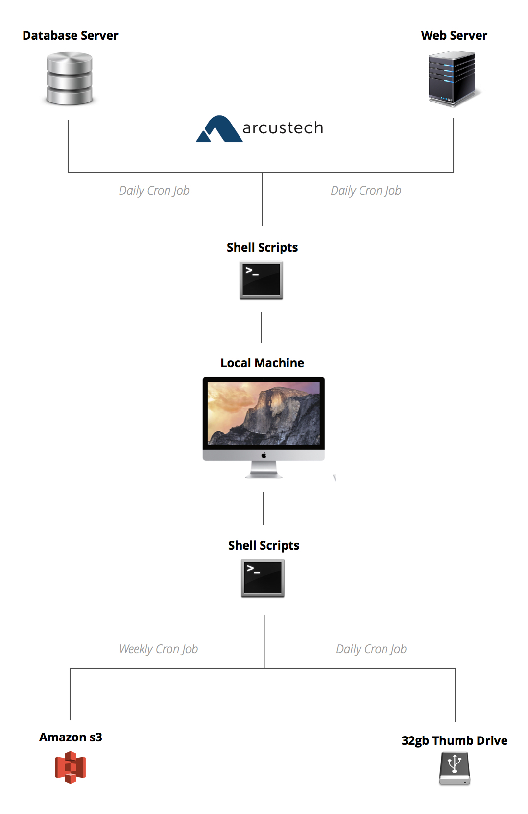
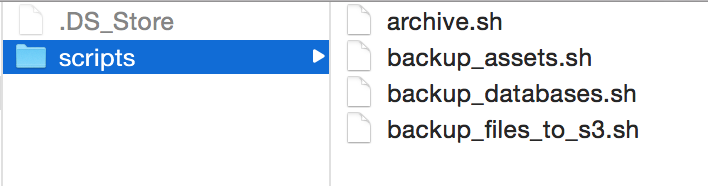
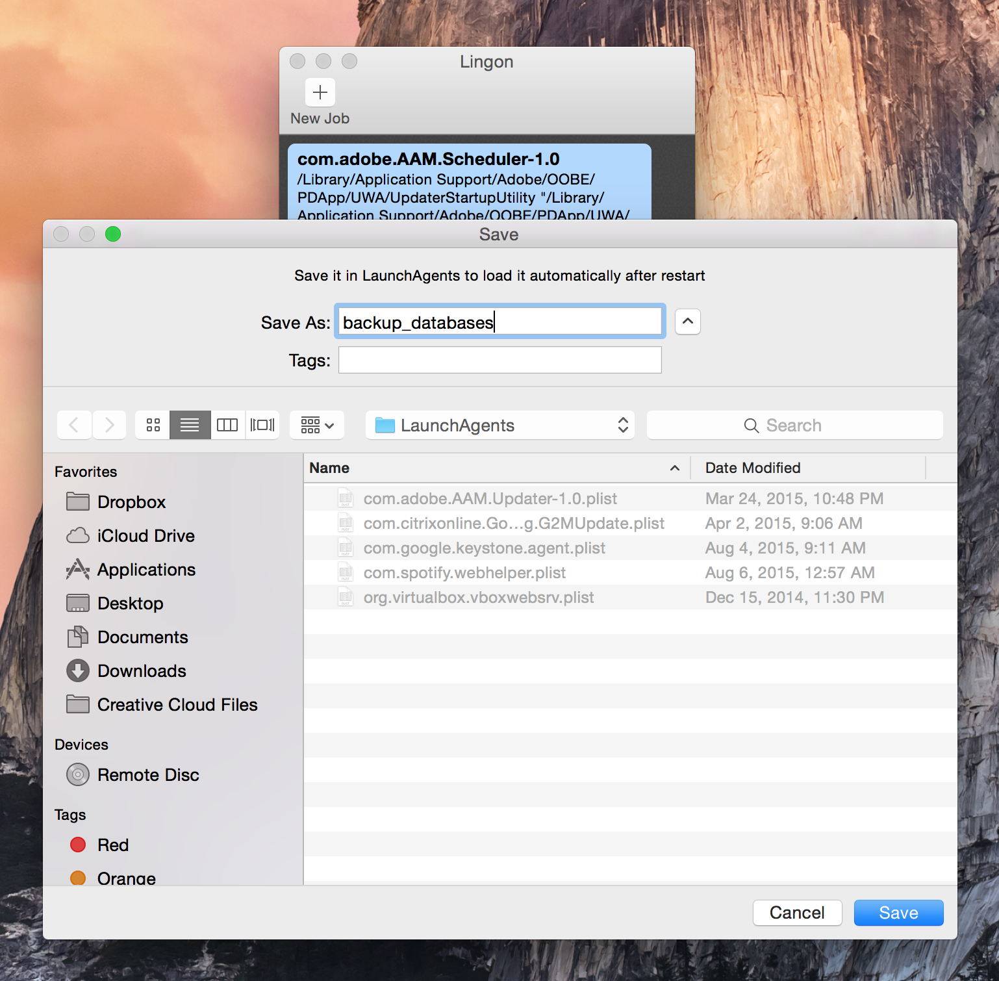
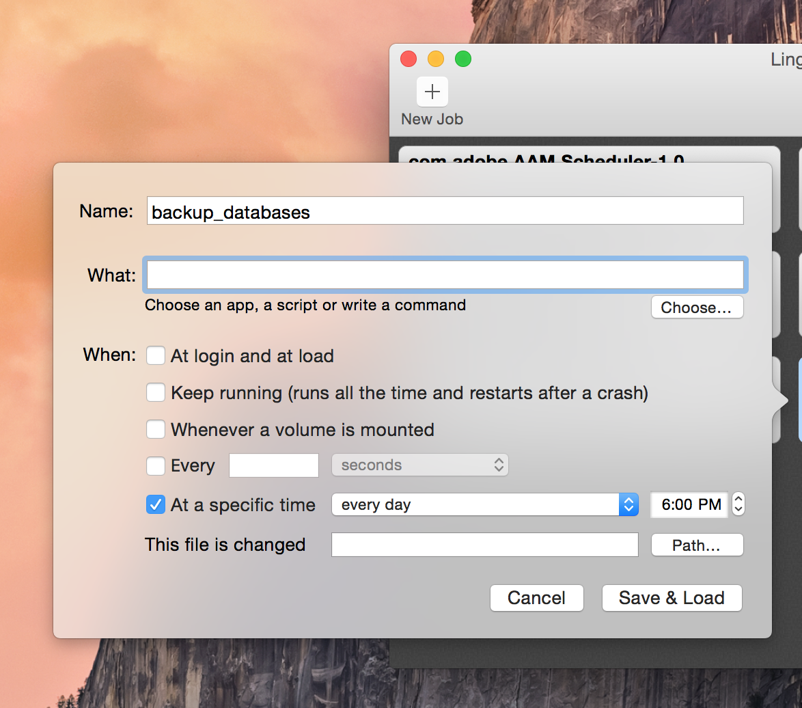

I know that you know you are supposed to have backups of your websites. But seriously, if there was some major catastrophic fail that resulted in an unrecoverable loss of data, would you be totally screwed? Could you replace your websites? How fast could you do it?

You know the feeling that immediately follows when something like this happens. The silent internal panic and paralysis. You can't even figure out where to start. What is just as bad is the feeling of knowing that if it did happened at any moment, you aren't prepared. There are two ways of dealing with that feeling: avoid it entirely because it's too overwhelming and just hope for the best OR deal with it head on and get completely prepared in case it happens (because it will). 

##Make Sure Everything Is Within Your Reach

Your hosting account will tell you they have daily backups, etc... But where are they? On the server that just failed? Who can get you these backups? The hosting provider's support team who are all busy because their servers have failed? Are they server snapshots? Massive zip files? Not sure about you but I HAVE to know these things. If your site goes down and data is lost and unrecoverable can you answer these simple questions?

  - Are you instantly notified?
  - Do you have the latest copy of your databases?
  - Do you have the latest copy of your assets? (physical data generated in production from users such as an uploads folder that a CMS stores files in)
  - Is your code version controlled and stored in a repository? (no excuse for this one!)

##Plan Out Every Step While You Can Think Clearly

It's critical to plan recovery beforehand when you are in a state of mind that can handle it. Get all of the cognitive effort out of the way and onto a checklist that you keep ready in case of emergency because you won't be able to think straight when it happens. Allow your brain to focus on keeping calm and not [doing this](http://i.imgur.com/VBPvN.gif).


##Do What Allows You The Quickest Recovery
 
What works best for me is having backups just one click away on the desktop of my work computer at the office. I have daily cron jobs running that pull the latest database and assets for each site onto my local machine. Then every Monday I have other cron jobs that will archive these backups and stores them on an Amazon s3 bucket and on an external thumb drive. It is easier to show this with a visual model:



##Do What Is Best For The People You Answer To

When disaster strikes you have to answer to bosses, customers, or maybe shareholders or executives and people who make decisions about your livelihood. You don't have to answer to peers on the internet or blog commenters who are one-upping you and suggesting you could do it a better way by doing xyz. 

You might wonder, "why would you use your local computer to run a cron job? Wouldn't that entirely depend on your local server to be running?". Yes it would... SO? When I REALLY think about it, is this a problem? Or would I avoid that just because it seems silly? You need to figure out what works best for your situation. For my situation this works fine and it was my best option when I factor in things such as:

  - How much time do I have available to devote for doing this stuff?
  - Will my cron jobs run when I am in the office anyway?
  - How many resources will these processes use on the production server?
  - Is it likely that any content changes when I am not at work (when my computer is on)
  - How often does my data change?

Again the primary goal here is that I have backups at my fingertips, that I make the recovery process as convenient as possible and that I get all of this done without taking too much time or building something too big.  

##Let's Get Techie

We need to do the following:
  
  - Write a shell script that backs up each database and stores them on your machine
  - Write a shell script that downloads assets and keeps them in sync
  - Write a shell script that archives these folders weekly and uploads them to an Amazon s3 bucket
  - Set up our cron jobs

Let's establish some fake site and configuration settings to make the examples more clear:

  - **Domain:** www.yourmom.com
  - **Database Name:** your_mom
  - **SSH User:** froggy_fresh
  - **MySQL Host:** 192.168.0.352
  - **MySQL User:** krispy_kreme
  - **MySQL Pass:** denzelwashington!

###Database Backups with mysqldump

Good ole mysqldump. You will need ssh access to your production server. Create a file and name it "backup_databases.sh" (you can name it whatever you want but add the .sh extension). Add the following:

```powershell
ssh froggy_fresh@yourmom.com mysqldump -h 192.168.0.352 -ukrispy_kreme -pdenzelwashington! your_mom > ~/path/backup.sql
```

What this is doing is logging in via SSH and then pulling down a database from that server onto your local computer. I have already configured logging in through SSH without a password by [using an ssh key](http://linuxconfig.org/passwordless-ssh). If you want to backup more than one database, just add another on a new line. 

###Download assets using Rsync

[Rsync](http://linux.die.net/man/1/rsync) is awesome. Instead of downloading everything all over again each time the cron runs, Rsync will just look at the remote folder and download only what has been changed. Much more performant and much easier on the server. Run it once on the command line to get everything downloaded and in sync initially and then it shouldn’t take long every time after that.

```powershell
rsync -az froggy_fresh@yourmom.com:path/to/server/folder /path/to/local/folder
``` 

###Archive Weekly and upload to s3 using Amazon AWS CLI

I want my backups to override existing backups so I don't have a million files for each day. However I do want a snapshot of these backups once a week. Every Monday there is a job that will archive them, and then another job to take those archives and put them in an Amazon s3 bucket.

Create "archive.sh" and add the following:

```powershell
#Create a date variable
NOW=$(date +"%F")

#Create a new folder for a given week
mkdir /Users/username/Desktop/cron/archived/$NOW

#Archive Sites
tar -zcvf /Users/username/Desktop/cron/archived/$NOW/[domain 1].tar.gz /Users/username/Desktop/cron/[domain 1]
tar -zcvf /Users/username/Desktop/cron/archived/$NOW/[domain 2].tar.gz /Users/username/Desktop/cron/[domain 2]
```

Now upload them to s3. For this you will need to [install AWS CLI](http://docs.aws.amazon.com/cli/latest/userguide/installing.html). After tinkering around and exploring other options trust me this is the fastest route to take. After you have installed and configured AWS CLI create another file and name it "backup_files_to_s3.sh". Add the following:

```powershell
NOW=$(date +"%F")
aws s3 cp /Users/username/Desktop/cron/archived/$NOW s3://[s3 bucket name]/$NOW --recursive
```

This one line will simply take everything in the folder (named as the output of $NOW. Example: "2015-09-13") and recursively back it up on an Amazon s3 bucket. This takes one folder containing a zip file of each of my sites. Those zip files contain two folders, "assets" and "database" which are pulled in daily from the first two shell scripts.  


###Cron Jobs Using Lingon

Now that we have our shell scripts setup we need to configure our cron jobs to run them. I chose to setup my cron jobs with a GUI because it saved me time. I wanted to just use a simple interface for selecting when they run, etc... I chose a mac app named [Lingon](https://www.peterborgapps.com/lingon/). Lingon lets you modify configuration files for your mac using a function called "launchd". It costs $9.99 but totally worth it IMO.

So far we have our 4 different jobs in one folder named scripts (name it whatever you want). 



After installing Lingon you will notice your other jobs running on your computer using launchd. To setup a job click on "New Job". Name your first job "backup_databases" and click save.



Next, configure your job. Under "what" find your file "backup_databases.sh" in your scripts folder. Then set when and how often you want your job running. It is as simple as that. 



After setting up and configuring all 4 jobs that should be it!

##Overview Of Response

At any given time, if I had to get a site on a different server I would follow these major steps (which I have much more detailed in a checklist):

  - Change configuration files
  - Deploy git repo
  - Import backup database
  - Upload backup assets
  - Change DNS

##References

The following things led to this blog post:

  - Chapter in the book [Great By Choice](http://www.amazon.com/dp/0062120999/?tag=googhydr-20&hvadid=33837902875&hvpos=1t1&hvexid=&hvnetw=g&hvrand=15695667650725605685&hvpone=16.84&hvptwo=&hvqmt=b&hvdev=c&ref=pd_sl_1vj6ftf1q5_b) by Jim Collins called "Productive Paranoia".
  - Great talk at Laracon 2015 talk by [Eryn O'Neil](https://twitter.com/eryno) titled "When It All Hits The Fan".
  - Can't sleep fears
  - The feeling of panic I have every time I get an email from [Pingdom](https://www.pingdom.com/)


