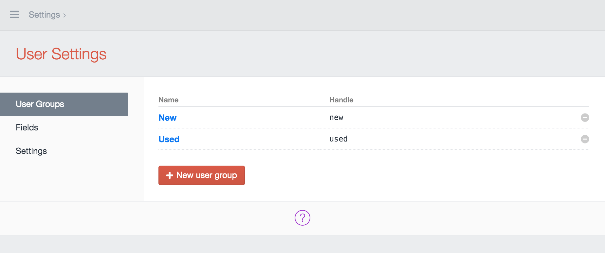
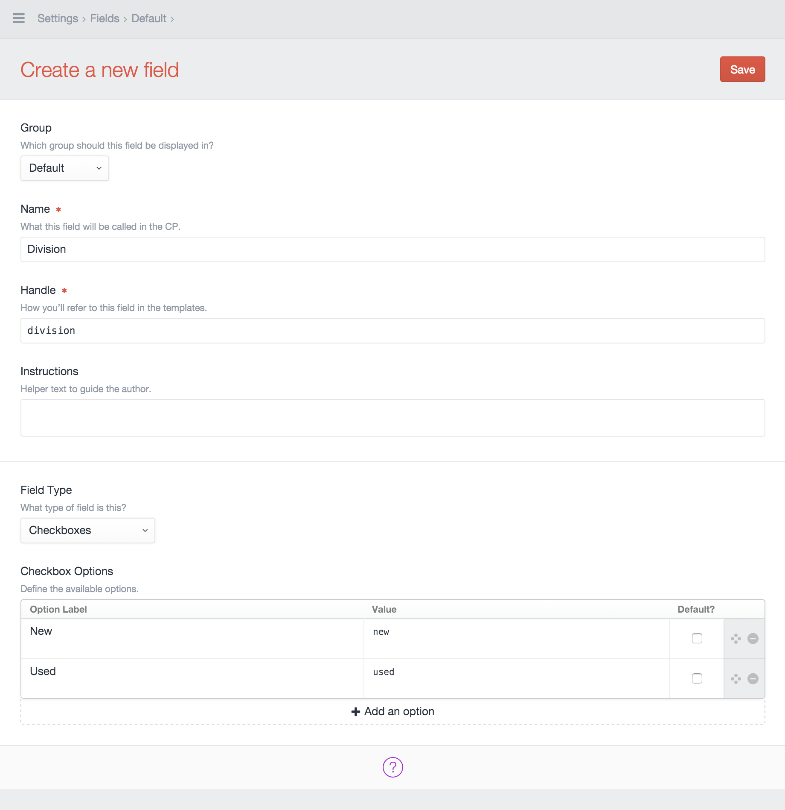
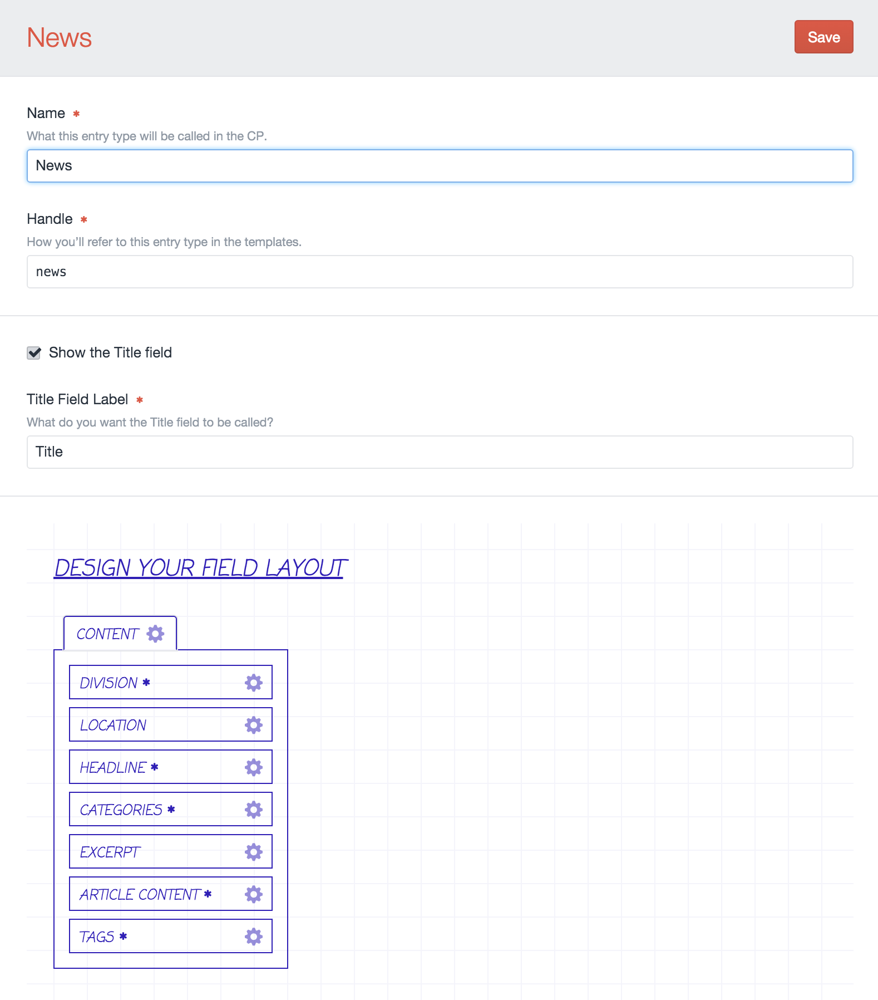
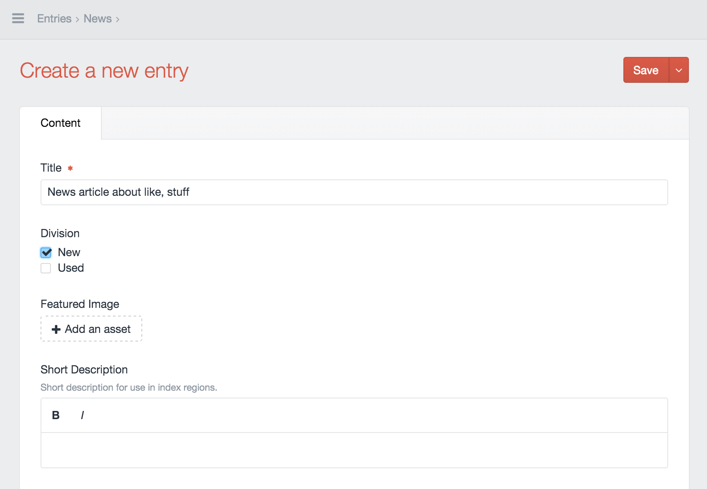
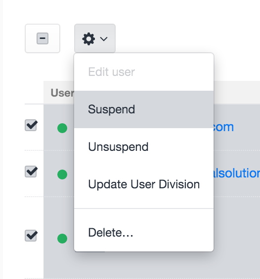

A common problem I have encountered when managing a Craft Site is when I want to show conditional content based on the currently logged in user.  Ideally there would be a native solution for this and you could add a user groups field to any section that would display the entry to only the user groups selected. As of now I do not think that exists so until then this approach might as work around. Either way just tweet at @angrybrad and tell him he needs to smile more.

##Scenerio
Let's say you have built an application using Craft that is being used by a single sales division of the company you work for. After hearing how awesome it is, another sales division wants it too so now you have to roll it out to them as well. This situation normally comes with very specific requirements and user permissions for each project have varying levels of granularity. In this case, only content specific to a each user's division(s) should be visible. For example: both divisions have news article and events. But some of these entries (like general corporate news), will overlap and apply to both divisions. Admins and content writers require assigning users and entries to multiple divisions.

##Approach
There are many ways to approach this. We can't leverage native user permissions because they are intended more for content authors who have access to the control panel. Again there isn't a native solution for assigning entries to user groups or specific users so we have to get a little creative. There are two ways we could do this: (and probably many others)

* Create a new category group with categories matching the user groups
* A regular ole checkbox fieldtype with values matching the user groups

Let's go with checkboxes since we already have categories and tags for both our news articles and events. You want to probably default on a solution that minimizes complexity.

##The Plan
* Create two new user groups. One per sales division. 
* Create a new division field (checkboxes) and assign it to both your news and events section. The handle for the user groups should be identical to the value's of your checkboxes.  
* Update both your news and events templates to conditionally show entries that have been assigned to the currently logged in user's user groups
* Bulk update your current user records and assign them to the current sales division user group
* Bulk update your entries and assign them as viewable to the current sales division
* Allow for users to select which division they belong to on the registration form

####Create User Groups
Create two user groups. Let's pretend one division sells used products, and the other sells new. 



####Create Division Field
Now create a new checkboxes field under the default field group and call it "division". 



####Assign The Field To Your Sections
When publishing entries you must assign each entry to a sales division. But first you need to add the division selectors to the sections you want to conditionally show content for. Navigate to Settings > [Section Name] > Entry Types and select your entry type. Drag your division field into the box for your field layout. 



####Assigning Your Entries To a Division
Now when publishing a news article, simply select which divisions it should be visible for. 



####Update Your Templates
Let's write some code up in here. We need to modify our entry tags to retrieve only the division(s) that the currently logged in user belongs to. I like to keep as much logic as I can out of my templates so for every Craft site I build I create a basic plugin named after the site itself. I wont go through entire process but if you aren't farmiliar with the basics, [check the docs](https://craftcms.com/docs/plugins/introduction) to get started. Keeping your business logic and helper functions in a Craft Variables class will make your templates so much cleaner. Let's call our company "ACME Sales". Within your plugin, create a new directory called "variables" and in that directory create a new file called "AcmeSalesVariable.php". The comments will explain each section of the following method:

```php 
<?php namespace Craft;

class AcmeSalesVariable {

	// Long function name but describes what it is doing pretty clearly
    public function buildSearchStringFromUserGroupsArray($groups)
    {
    	// If the user is assigned to one or more groups 
    	// We will always need the first group regardless
        $search = 'division:' . $groups[0]['handle'];

        // If the user is assigned to more than one group,
        // append the others to the search string with an OR statement
        foreach($groups as $key => $value)
        {
            if($key > 0) {               
                $search .= ' OR division:' . $value['name'];
            }
        }

        return $search;
    }
}
```

We are passing the users groups and constructing the string that will be used to search entries for our divisions. Now you can access this method in your twig template and store it in a variable with the following tag:

```php

```

If a user were assigned to both groups, "new" and "used", the search variable would contain the following string: "division:new OR division:used". This will [search our entries](https://craftcms.com/docs/searching) using Craft's entries tag.

```php


    <p>
    	<strong><a href="{{ entry.url }}">{{ entry.title }}</a></strong>    
    </p>

```

If a user is logged in and assigned to the "new" sales division, they will see entries that are only assigned to "new". If they are assigned to both divisions, they will see all entries assigned to both "new" and "used".  

####What About Existing Users and Entries?

If you have hundreds of existing records already, it's not feasible to go in and update each entry. We need a way to bulk update both the existing users and entries with the appropriate assignments. Up until this point you only have users and entries for one division so updating them with the same value makes this much more simple. 

So how can we update multiple entries? Let's do this with an [element action](https://craftcms.com/docs/plugins/element-actions). 

####Adding An Element Action Class

In your plugin's directory, create a new directory called "elementactions". In it, create a file called "AcmeSales_UpdateUserDivisionElementAction.php". This will contain your element action class. 

```php
<?php namespace Craft;

class AcmeSales_UpdateUserDivisionElementAction extends BaseElementAction
{
    /**
     * getName
     *
     * @return null|string
     */
    public function getName()
    {
        return Craft::t('Update Users Division');
    }

    /**
     * performAction
     *
     * @param ElementCriteriaModel $criteria
     * @return bool
     */
    public function performAction(ElementCriteriaModel $criteria)
    {
        $elements = $criteria->find();
        foreach ($elements as $user)
        {
            // Normally you would want to extract this to a service method like:
            // craft()->acmesales->updateUserDivision($user) but for the sake
            // of simplicity I put it directly in the element action class
            

            // Put the user's groups into an array
            $groups = [];
            foreach($user->getGroups() as $value) {
                $groups[] = $value->name;
            }

            // Update the user (add validation though when you do this)
            $user->getContent()->setAttributes([
                'division' => $groups
            ]);
            craft()->users->saveUser($user);
        }


        $this->setMessage(Craft::t('Action Updated.'));
        return true;
    }
}
```

Lastly, you just have to hook in your element action through your plugin class (AcmeSalesPlugin.php) with the following method:

```php
public function addUserActions($source)
{
    return [
        'AcmeSales_UpdateUserDivision'
    ];
}  
```

This adds the option to run the element action on the elements index page in the control panel:




You could simply select all users and run this action on them all at once. You would follow the same process in creating an element action for the entries. One remaining thing you might want to do is have users select their division when they are registering so you can auto assign them to the approporiate user group.

##Caution

Be careful with caching when showing conditional content. Serving content to users who shouldn't see it can end up being very bad. A way I solve this is the add the user's groups into a url segment instead of pulling the groups directly in your templates. Then you can cache all of the entries without worrying since cached files are stored for each url. You have to consider this and balance performance vs complexity differently for every project.  

Don't forget to tweet @angrybrad. Tell him you found a bunch of bugs.


